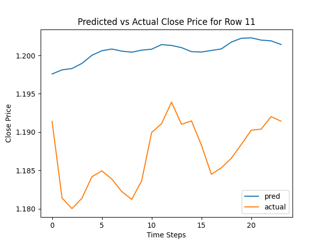
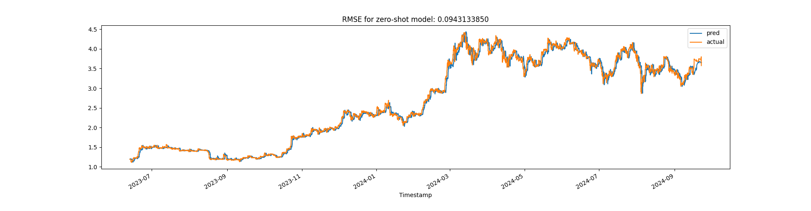
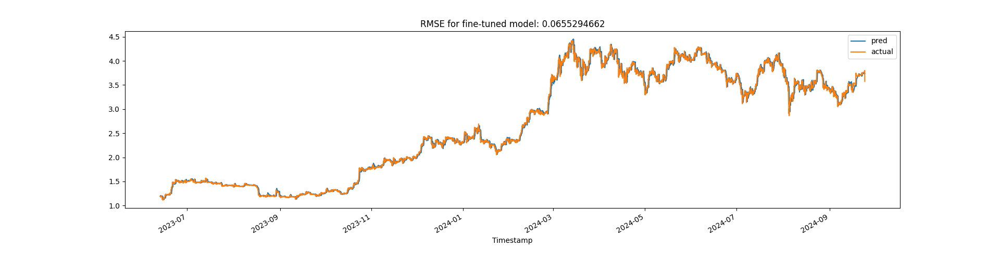

# BitcoinPrices
Predicting Bitcoin Close Prices using Foundational Models (Time Series.)

> Ce projet met en avant la puissance du fine-tuning pour affiner les modèles de séries temporelles et améliorer leur capacité prédictive sur des marchés volatils comme le Bitcoin.

# Présentation
Ce projet permet de créer un modèle de prédiction des prix de clôture du bitcoin avec les **séries temporelles** en utilisant le modèle **Tiny Time Mixer (TTM) d’IBM**. Pour cela,
on va explorer 2 approches :
- Zero-shot learning
- Fine-tuning

On va :
- Préparer les données.
- Utiliser un modèle pré-entraîné et l'ajuster à nos données.
- Évaluer la performance des prédictions du modèle à l’aide de métriques comme le RMSE.

Le Tiny Time Mixer (TTM) est un modèle pré-entraîné développé par IBM pour 
la prévision de séries temporelles multivariées. Introduit en 2024, il est 
performant, léger et efficace.

# Objectifs du projet
- Installer l'environnement de travail pour le modèle TTM. (Torch, Hugging Face, Pandas, Numpy, etc.)
- Préparer le dataset (prix du Bitcoin).
- Comprendre l'architecture du modèle TTM.

# Installation 
```bash
git clone
cd BitcoinPrices
python3 -m venv venv
source venv/bin/activate
pip install --upgrade pip
pip install -r requirements.txt
deactivate
```
Si quelque chose ne marche pas, il faut aller sur le github de IBM:
- https://github.com/IBM/tsfm.git et installer tsfm:
- pip install ".[notebooks]" seaborn==0.13.2

# Dataset
Pour le dataset en question, le dossier _models_ contient divers modèles pré-entraînés pour la prédiction de séries temporelles, afin de ne pas avoir à les entraîner soi-même, car c'est long.
Ainsi dans models/zero_shot_model par exemple on retrouve :
- _config.json_ qui contient toute la configuration du modèle (taille de couches du réseau de neurones, fonction d'activation, etc.), qui permet de recharger le modèle.
- _training-args.bin_ qui contient les arguments d'entraînement du modèle, sauvegardés par Hugging Face, qui permet de reprendre l'entrainement du modèle.
- _model.safetensors_ est le fichier qui contient le plus de poids du modèle. C'est plus rapide qu'un binaire.

Il y a aussi des fichiers _.pkl_ (pickles), qui contiennent des prédictions déjà effectuées.
Les fichiers .pkl contiennent des prédictions pré-calculées pour simplifier l'exécution du projet. Ainsi, l'objectif est de comprendre le fonctionnement du modèle TTM sans avoir à exécuter de lourds calculs.

## Fichiers
sample_btcusd.csv est un fichier d'1 million de ligne qui sert de dataset, qui est tronqué d'un fichier de 6 millions de lignes qui contient des données sur 
le bitcoin, à partir de 2012 et jusqu'à 2014 à CHAQUE SECONDES.

À la base, la colonne TimeStamp est de type UNIX time (nb de secondes, depuis le 1 Janvier 1970), on peut la convertir avec Pandas :
- pd.to_datetime(df['TimeStamp'], unit='s')

Pour réduire la taille, on utilise :
- resample() pour moyenner les minutes en heures.
- dropna() pour supprimer les valeurs manquantes.
- reset_index() pour réinitialiser l'index.

## Valeurs manquantes
On peut utiliser:
- isna(), qui est une méthode Pandas qui renvoie un masque booléen de la même forme que le DataFrame, indiquant les valeurs manquantes.
Si on trouve une valeur manquante, on peut utiliser :
- ffill() qui permet de remplir les valeurs manquantes avec la dernière valeur non manquante.

## Data Prep
On va performer un **Zero-shot learning**. On va faire une prédiction sans entrainer le modèle. 
D'abord on va couper le dataset en :
- Training set (80%)
- Validation set (10%) permet d'ajuster le modèle.
- Test set (10%)

On utilise la classe **Trainer** de la biblithèque **Hugging Face** pour évaluer les performances du modèle. Puis on peut calculer le **RMSE** (Root Mean Squared Error) pour évaluer les performances du modèle.
```
RMSE = sqrt(1/n * sum((y_true - y_pred)^2))
```
Si la racine carré de eval_loss vaut ~ 0.064, cela signifie que l'erreur
moyenne des prédictions est d'environ 6.4 cents.

# TSMF (Time Series Model Framework)
TSMF est une framework conçu pour préparer les données afin qu'elles soient compatibles avec le modèle TTM (Tiny Time Mixer).

**TimeSeriesPreprocessor (TSP)** est un utilitaire qui prépare les séries temporelles pour le modèle TTM.

On utilise aussi la fonction get_datasets(), qui prends comme paramètres :
le tsp, le dataset et la config des sous-ensembles (train, val, test).

# Processus de prévisions
- Le modèle regarde 512 points (t1 à t512)
- Il prédit les 96 futures valeurs (t513 à t609)
- Il n'affiche que 24 et les compares avec des vraies données
- la fenêtre glisse : t2 à t513, t3 à t514, etc.
- la prévision s'arrête quand on a plus 512 points à regarder.

# Prédictions et comparaisons
Après avoir fait une prédiction,
on utilise pandas pour comparer les prédictions avec les vraies valeurs pour la 11ème ligne du dataset. Le modèle est entrainé pour prédire les tendances générales mais il ne capte pas la volatilité à court terme.



On peut aussi comparer avec une fonction qui permet d'automatiser la comparaison en se
concentrant sur un nombre d'heure dans le futur.

# Fine-tuning
Le **fine-tuning** est une technique en apprentissage automatique où l'on ajuste un modèle pré-entraîné pour l'adapter à une tâche spécifique.

1) On charge un modèle pré-entraîné.
2) On utilise un **early stopping** pour éviter le sur-apprentissage.
3) On instancie la méthode de **callback** pour suivre l'évolution du modèle.
4) On configure l'**optimiseur** AdamW, qui ajuste le poids du modèle pour minimiser l'erreur.
5) On programme le taux d'apprentissage avec un **scheduler**. (ici OneCycleLR), qui permet
d'accélérer l'apprentissage.
6) On initialise le **Trainer** pour automatiser l'entrainement du modèle et son évaluation.
7) On intègre le modèle fine-tuné dans un pipeline de prévision pour générer des prédictions sur de nouvelles données.


# Conclusion
Dans la première image, on observe le modèle avant le fine-tuning (en zero-shot) : 

La racine carrée de l'erreur moyenne (RMSE) est de 0.0943133850 (~0.094), ce qui signifie que le modèle performe bien. On voit sur l'image que les prédictions sont proches des vraies valeurs.

Dans la deuxième image, on observe le modèle après le fine-tuning :

La racine carrée de l'erreur moyenne (RMSE) est de 0.0655294662 (~0.065), ce qui signifie que le modèle performe encore mieux. On voit sur l'image que les prédictions sont proches des vraies valeurs.

Ainsi, fine-tuner le Tiny TIme Mixer model (TTM) permet grandement d'améliorer les performances du modèle, ce qui le rend plus précis pour prédire des prix complexes sur des seriés temporelles volatiles.