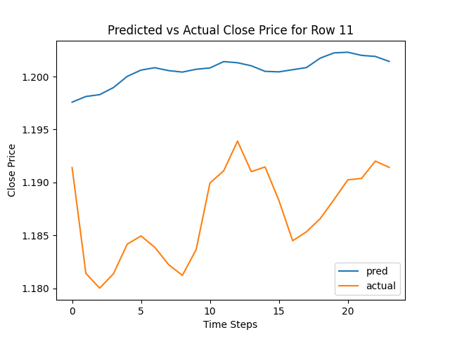

# BitcoinPrices
Predicting Bitcoin Close Prices using Foundational Models (Time Series.)

# Présentation
Ce projet permet d'apprendre la prévision de **séries temporelles** en 
utilisant le modèle **Tiny Time Mixer (TTM) d’IBM**. En travaillant sur les prix 
du Bitcoin, il couvre la préparation des données, l'entraînement du modèle et 
l’évaluation des prédictions à l’aide de métriques comme le RMSE. 

Le Tiny Time Mixer (TTM) est un modèle pré-entraîné développé par IBM pour 
la prévision de séries temporelles multivariées. Introduit en 2024, il est 
performant, léger et efficace.

# Objectifs du projet
- Installer l'envirronement de travail pour le modèle TTM.
- Préparer le dataset (prix du Bitcoin).
- Comprendre l'architecture du modèle TTM.
- Entrainer le modèle.
- Analyser les performances du modèle.
- Explorer les différentes options de personnalisation du modèle.

# Installation 
```bash
git clone
cd BitcoinPrices
python3 -m venv venv
source venv/bin/activate
pip install --upgrade pip
pip install -r requirements.txt
deactivate
```
Si quelque chose ne marche pas, il faut aller sur le github de IBM:
- https://github.com/IBM/tsfm.git et installer tsfm:
- pip install ".[notebooks]" seaborn==0.13.2

# Dataset

## Fichiers
sample_btcusd.csv est un fichier d'1 million de ligne qui sert de dataset, qui est tronqué d'un fichier de 6 millions de lignes qui contient des données sur 
le bitcoin, à partir de 2012 et jusqu'à 2014 à CHAQUE SECONDES.

À la base, la colone TimeStamp est de type UNIX time (nb de secondes, depuis le 1 Janvier 1970), on peut la convertir avec Pandas :
- pd.to_datetime(df['TimeStamp'], unit='s')

Pour réduire la taille, on utilise :
- resample() pour moyenner les minutes en heures.
- dropna() pour supprimer les valeurs manquantes.
- reset_index() pour réinitialiser l'index.

## Valeurs manquantes
On peut utiliser:
- isna(), qui est une méthode Pandas qui renvoie un masque booléen de la même forme que le DataFrame, indiquant les valeurs manquantes.
Si on trouve une valeur manquante, on peut utiliser :
- ffill() qui permet de remplir les valeurs manquantes avec la dernière valeur non manquante.

## Data Prep
On va performer un **Zero-shot learning**. On va faire une prédiction sans entrainer le modèle. 
D'abord on va couper le dataset en :
- Training set (80%)
- Validation set (10%) permet d'ajuster le modèle.
- Test set (10%)

On utilise la classe **Trainer** de la biblithèque Hugging Face pour évaluer les performances du modèle. Puis on peut calculer le **RMSE** (Root Mean Squared Error) pour évaluer les performances du modèle.
```
RMSE = sqrt(1/n * sum((y_true - y_pred)^2))
```
Ici il vaut la racine carré de eval_loss ~ 0.064. Ce qui signifie que l'erreur
moyenne des prédictions est d'environ 6.4 cents.

Puis on fera un **Fine-tuning** pour améliorer les performances.

# TSMF (Time Series Model Framework)
TSMF est un outil conçu pour préparer les données afin qu'elles soient compatibles avec le modèle TTM (Tiny Time Mixer).

**TimeSeriesPreprocessor (TSP)** est un utilitaire qui prépare les séries temporelles pour le modèle TTM.

On utilise aussi la fonction get_datasets(), qui prends comme paramètres :
le tsp, le dataset et la config des sous-ensembles (train, val, test).

# Processus de prévisions
- Le modèle regarde 512 points (t1 à t512)
- Il prédit les 96 futures valeurs (t513 à t609)
- Il n'affiche que 24 et les compares avec des vraies données
- la fenêtre glisse : t2 à t513, t3 à t514, etc.
- la prévision s'arrête quand on a plus 512 points à regarder.

# Prédictions et comparaisons
Après avoir fait une prédiction,
on utilise pandas pour comparer les prédictions avec les vraies valeurs pour la 11ème ligne du dataset. Le modèle est entrainé pour prédire les tendanves générales mais il ne capte pas la volatilité à court terme.



On peut aussi comparer avec une fonction qui permet d'automatiser la comparaison en se
concentrant sur un nombre d'heure dans le futur.

